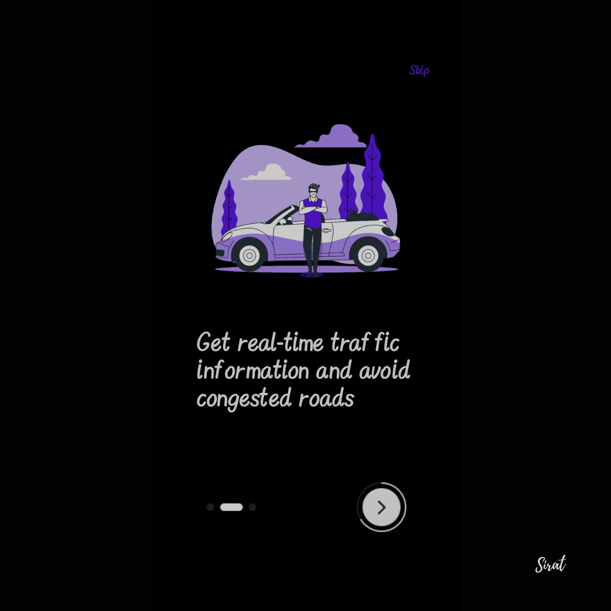
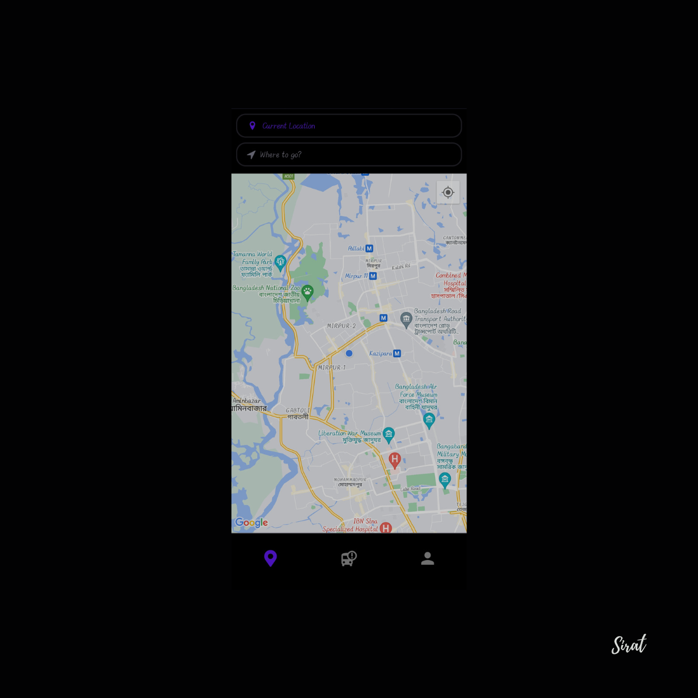

# RoadAhead 

RoadAhead is an advanced AI model that revolutionizes urban mobility by providing real-time traffic data. With RoadAhead you can know the best route. It also provides real-time weather updates and the impact on traffic.
It's the best solution for your next traffic update.
<p align="center">
  
  
  
  
  
</p>

## Features
<div align="center">

| Feature                      | Description                                   |
|------------------------------|-----------------------------------------------|
| **Realtime Traffic Data** | The user will get real-time traffic updates.       |
| **Realtime Weather Data**                    | Weather updates will be up-to-date.|
| **Necessary Alerts**               | Notifications based on weather conditions will be provided.|
  
</div>

## Installation
### Prerequisites
- Node.js
- npm or yarn
- React Native Expo CLI
- Android Studio and/or Xcode for emulation

### Steps

1. Clone the repository
    ```bash
    git clone https://github.com/yourusername/your-repo.git
    ```
2. Navigate to the project directory
    ```bash
    cd your-repo
    ```
3. Install dependencies
    ```bash
    npm install
    ```
4. If using Expo, start the development server
    ```bash
    npx expo start
    ```

## Project Structure
```markdown
- /app
  - /components
  - /(auth)
  - /(into)
  - /(edit)
  - /(tabs)
  - /assets
- tailwind.config.js
- babel.config.js
- package.json
 ```

<div align="center">

<b> Thank You !  </b>
  
</div>
